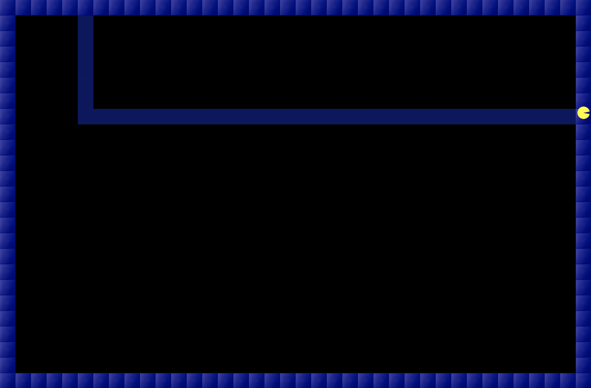
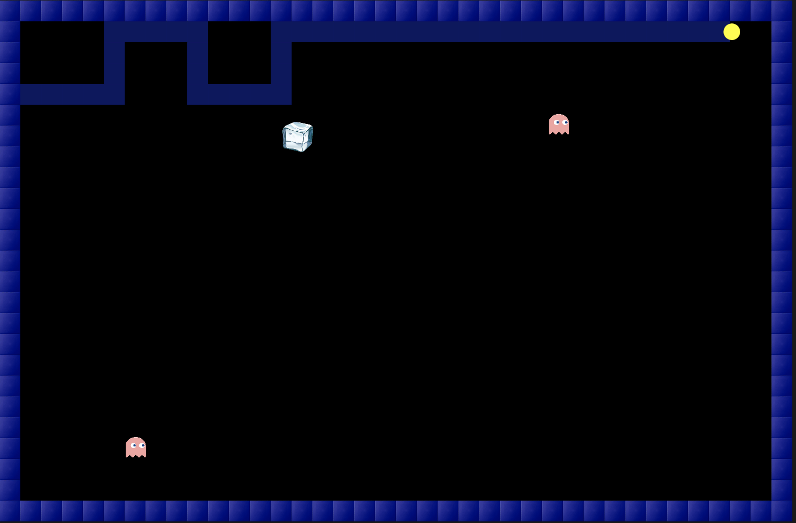

# Pac-Xon-Premium
Pac-Xon Premium, extended from Pac-Xon Deluxe - a Pac Man inspired game, was one our team member’s childhood favorite. Pac-Xon Deluxe, the original game, is fairly simple with numerous levels with increasing difficulty. The experience of the game seems to be fairly decent and easy at first, however as you start completing the levels it gets interesting. However, the increase in difficulty is very gradual, such that you may lose interest in playing further due to repetitiveness, and even the most difficult level may not present that great of a challenge to you. Additionally, the graphics of the game were classic but old, and we believed we could associate a modern touch and feel to the game and produce a revamped and customized version of it.

As I mentioned that the gameplay may seem pretty simple, at first glance, we thought it would be something fairly simple to code. However, as we progressed and laid out the logic and technical aspects required for the smallest of detail in the game, we realized that it involves a relatively complex algorithmic approach, rather than using just simple Object Oriented Programming coupled with Javascript Basics. Since we wanted to take the game a step further, we wanted to ensure that almost all objects interact amongst each other, all of which was to be wrapped in the complexity of a tile-based game!

As our first step, using Javascript, and particularly the p5 JS library, we started off with creating a 2D Array/ List which was technically mapped over the entire canvas, or rather drawn over the area of the canvas, such that each index in the 2D Array/ List represented a 20px by 20px box on the canvas of the game. Then we took an approach such that a value 1 at any index would draw a solid blue tile (20px by 20px) on the canvas at the position corresponding to the index of the 2D Array/ List. Similarly, if the value was to be 0, nothing was to be drawn and if the value was to be -1, a different blue tile representing a ‘line’ would be drawn instead. Then we created functions which handled the filling of the array and included functionalities like initializing the array borders at the beginning of the game and those that checked for if any values in the 2D Array were modified and matched a certain criteria for a tile to be drawn at that position, or even to map the values of the x and y coordinates on the canvas to the array position and the tile at that very location.

Once we were satisfied with the Array functionality, we started off with creating the Player Class that drew the user controlled character on the screen. This was the class that we found to be the most challenging, since we had to incorporate the functionality of an object of a Player class with its movement being in accordance with the functionality of the 2D Array. Drawing, and moving the player was very simple, however when we changed the direction of the Pac-Xon, it was causing the Pac-Xon to be moving between two different tiles as shown below:

In order to solve this problem, we created a rounding function that checks the player’s position and checks the tile, from the two tiles that it intersects, on which the majority of the player’s body lies and forces the player to be pushed or pulled onto that tile as it changes its direction. We tried other approaches, including the reduction of FrameRate or increasing the speed by the size of the tile, however both of them resulted in reduced game play quality. 

Moving on, we allowed for the player to draw connecting lines between two solid blocks. This was done mainly by using the position of the tile that the player is present at and then checking whether the player is at an empty area or a solid position, and then drawing a ‘line’ tile if the condition is fulfilled. We extended this approach to allow for checking the next tile and ensuring the player does not bump into the line that is being formed, we also somewhat extended the same approach to ensure restrict the movements when the player is forming the line or is within the solid block region. 

However, the most difficult part of the project was to fill the appropriate ‘boxes’, which are certain enclosed regions in the canvas when the line connects between two solid tiles. A demonstration of this is:

The complications with this was not only the procedure to fill the region, but in fact the considerations to take into account when filling this. A brief overview of them include that the region should not fill if the enemy is present inside of the region, or if multiple regions are created, all of the smallest ones should fill up, and only the largest one and/or the ones including the enemy should remain empty such that:

The approach to solve this was using the following algorithms:

<a href = "https://learnersbucket.com/examples/algorithms/flood-fill-algorithm-in-javascript/"> - Flood Fill Algorithm</a>

<a href = "https://dev.to/seanpgallivan/solution-max-area-of-island-4njk">- Max Area of an Island (LeetCode Problem)</a>

We used the Max Area of an Island Algorithm, which compares the areas of all the individual regions and finds out the maximum of those, and modified it to instead return x and y coordinates of each of the regions. We then used these coordinates to find the areas of all the regions, with an intermediary step checking if the enemy was present in any of the regions then to not take it into consideration, and then from those areas we excluded the maximum area and used all the other coordinates to fill the smaller areas. In this manner, we were able to achieve the desired result through extensively comprehending the complex recursive algorithms.

After this, we implemented the enemy classes where each type of enemy had a class that inherited from the main enemy class for the features that were common amongst all enemies. The movement of the enemies used a similar approach of checking the tiles around it and reversing its speed if it encountered the solid tile; this was then extended to allow some enemies to eat the solid tiles when they bounced off of them as well. The enemy class interacted with the Player class to check for collisions with the player.

Moving on, we incorporated the Powerups class, where the various power ups were placed at certain positions, like the bomb was to only show up in the region with the solid tiles. The power ups then interacted with the Player and Enemy class both, where either of them could use the power ups effect. 

The last complex step was to incorporate the various screens with state variables at certain positions. It produced a lot of variables and seemed like a logic gate problem solved with boolean variables instead of gates. The changing of states and ensuring that the correct screen appears after one another was challenging to keep track of. 

The final touches were to add sound, fix any bugs with interactions and movements or any logical errors in the algorithm. With all the effort put in, the end product seemed very satisfactory and came up together better than our initial expectations!
